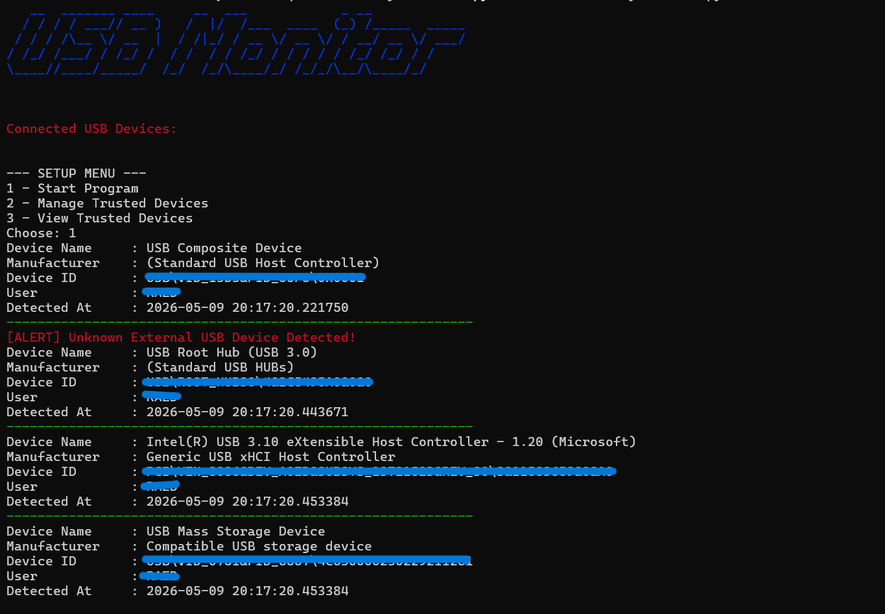

# USB Activity Monitor

A lightweight USB monitoring tool for Windows built with Python.

This project monitors connected USB devices, logs activity, and alerts on unknown external USB devices.

---

# Features

- Detect connected USB devices in real time
- Display:
  - Device Name
  - Manufacturer
  - Device ID
  - Current User
  - Detection Time
- Sound alert when a new USB device is connected
- USB activity logging system
- Trusted devices allowlist
- Alert for unknown external USB devices
- Setup menu for managing trusted devices
- Ignore duplicate device detection during runtime
- Save trusted devices using JSON

---

# Security Purpose

This project was created to practice basic USB monitoring and device detection concepts using Python.

It focuses on:
- USB activity monitoring
- Device identification
- Event logging
- Basic unknown device alerts

---

# Technologies Used

- Python
- WMI
- Colorama
- PyFiglet
- Threading
- Logging
- JSON

---

# Installation

Install required libraries:

```bash
pip install wmi colorama pyfiglet
```

---

# Usage

Run the program:

```bash
python USB_Activity_Monitor.py
```

---

# Setup Menu

The program includes a simple setup menu for:

- Starting the monitor
- Adding trusted USB devices
- Removing trusted devices
- Viewing trusted devices

---

# Generated Files

## usb_activity.log
Stores USB activity logs.

## trusted_devices.json
Stores trusted USB device IDs.

---

# Example Output

```text
Device Name     : USB Composite Device
Manufacturer    : (Standard USB Host Controller)
Device ID       : (DEVICE_ID)
User            : (USERNAME)
Detected At     : 2026-05-09 18:55:33
------------------------------------------------------------
```

---

# Screenshot



---

# Current Limitations

- Windows only
- Basic USB filtering
- No graphical interface
- No advanced device history tracking

---

# Author

RAED
